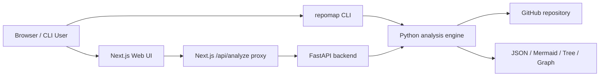
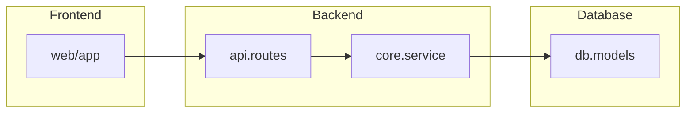

# repomap

Turn any GitHub repository into an architecture diagram.

将任意 GitHub 仓库转换为架构图。

`repomap` is a repository architecture explorer with a Python analysis engine, a FastAPI backend, and a Next.js + D3.js web UI. It clones a GitHub repository, detects modules and dependencies, infers top-level layers, and renders the result as a folder tree, JSON graph, Mermaid diagram, and interactive graph.

`repomap` 是一个仓库架构分析工具，包含 Python 分析引擎、FastAPI 后端以及 Next.js + D3.js Web 界面。它可以克隆 GitHub 仓库、检测模块与依赖、推断顶层架构层，并将结果渲染为目录树、JSON 图、Mermaid 图以及交互式关系图。

## Highlights

### English

- Analyze GitHub repositories from a CLI or web UI
- Detect Python, JavaScript, and Go automatically
- Build dependency graphs with `networkx`
- Infer `Frontend`, `Backend`, `Database`, `Infrastructure`, and `Shared` layers
- Export folder tree, JSON, and Mermaid output
- Explore an interactive graph in the browser with D3.js
- Use a same-origin Next.js proxy to avoid frontend `Failed to fetch` issues in local development
- Configure `allowedDevOrigins` for LAN-based Next.js development

### 简体中文

- 既支持命令行，也支持 Web 界面分析 GitHub 仓库
- 自动识别 Python、JavaScript、Go
- 使用 `networkx` 构建依赖关系图
- 自动推断 `Frontend`、`Backend`、`Database`、`Infrastructure`、`Shared` 等架构层
- 支持导出目录树、JSON 和 Mermaid
- 使用 D3.js 在浏览器中交互式浏览架构图
- 通过 Next.js 同源代理避免本地开发时前端出现 `Failed to fetch`
- 支持配置 `allowedDevOrigins`，解决局域网访问开发服务器时的 Next.js 警告

## Architecture

### English

The project is organized as a small monorepo:

```text
repomap/
├── repomap/        # Core analysis engine
├── repomap_api/    # FastAPI backend
├── web/            # Next.js + D3.js frontend
├── Dockerfile.api
└── docker-compose.yml
```

System flow:



### 简体中文

项目采用小型 monorepo 结构：

- `repomap/`：核心分析引擎
- `repomap_api/`：FastAPI 后端
- `web/`：Next.js + D3.js 前端

前端通过同源 `/api/analyze` 请求 Next.js 路由，再由服务端代理请求 Python API，这样可以避免浏览器直接跨域访问后端时出现的连接问题。

## Quick Start

### English

Install Python dependencies:

```bash
python -m pip install -e .
```

Run the backend:

```bash
cp .env.api.example .env
uvicorn repomap_api.main:app --reload --host 0.0.0.0 --port 8000
```

Run the frontend:

```bash
cd web
cp .env.example .env.local
npm install
npm run dev
```

Open:

```text
http://localhost:3000
```

### 简体中文

安装 Python 依赖：

```bash
python -m pip install -e .
```

启动后端：

```bash
cp .env.api.example .env
uvicorn repomap_api.main:app --reload --host 0.0.0.0 --port 8000
```

启动前端：

```bash
cd web
cp .env.example .env.local
npm install
npm run dev
```

浏览器访问：

```text
http://localhost:3000
```

## CLI Usage

### English

```bash
repomap https://github.com/user/repo
repomap https://github.com/user/repo --branch main
repomap https://github.com/user/repo --json-out architecture.json --mermaid-out architecture.mmd
```

### 简体中文

```bash
repomap https://github.com/user/repo
repomap https://github.com/user/repo --branch main
repomap https://github.com/user/repo --json-out architecture.json --mermaid-out architecture.mmd
```

命令行可以直接输出目录树、JSON 架构图和 Mermaid 图。

## Web UI

### English

The web interface accepts:

- GitHub repository URL
- optional branch name

It displays:

- interactive architecture graph
- architecture layers
- selected module details
- folder tree
- Mermaid output

### 简体中文

Web 界面支持输入：

- GitHub 仓库地址
- 可选分支名

显示内容包括：

- 交互式架构图
- 架构层摘要
- 当前模块详情
- 目录树
- Mermaid 输出

## Fixes for Next.js warning and `Failed to fetch`

### English

This repository now includes two changes specifically for the issues you saw:

1. `allowedDevOrigins` is configured in [web/next.config.mjs](web/next.config.mjs) so LAN development hosts such as `192.168.164.1` can access `/_next/*` resources without the upcoming Next.js restriction warning.
2. The frontend no longer calls the Python API directly from the browser. Instead, it sends requests to the same-origin route [web/app/api/analyze/route.js](web/app/api/analyze/route.js), which proxies the request to the backend using `REPOMAP_API_URL`. This avoids common local network and CORS-related `Failed to fetch` errors.

Frontend environment example:

```env
REPOMAP_API_URL=http://127.0.0.1:8000
ALLOWED_DEV_ORIGINS=localhost,127.0.0.1,192.168.164.1
```

### 简体中文

这个仓库已经针对你遇到的两个问题完成修复：

1. 在 [web/next.config.mjs](web/next.config.mjs) 中加入了 `allowedDevOrigins`，允许像 `192.168.164.1` 这样的局域网开发地址访问 `/_next/*` 资源。
2. 前端不再由浏览器直接请求 Python API，而是改为请求同源的 [web/app/api/analyze/route.js](web/app/api/analyze/route.js)，再由 Next.js 服务端代理到后端 `REPOMAP_API_URL`，从而减少本地网络环境导致的 `Failed to fetch`。

推荐前端环境变量：

```env
REPOMAP_API_URL=http://127.0.0.1:8000
ALLOWED_DEV_ORIGINS=localhost,127.0.0.1,192.168.164.1
```

## Example Output

### English

```text
Project Architecture
repo
├── api
├── core
├── db
└── web
```

```json
{
  "primary_language": "Python",
  "architecture_layers": [
    { "name": "Frontend", "module_count": 6 },
    { "name": "Backend", "module_count": 18 },
    { "name": "Database", "module_count": 4 }
  ]
}
```



### 简体中文

输出结果通常包括：

- 目录树
- JSON 架构图
- Mermaid 图
- D3 交互式关系图

## Deployment

### English

Frontend on Vercel:

1. Import the repository into Vercel
2. Set `Root Directory` to `web`
3. Set environment variable `REPOMAP_API_URL` to your backend API
4. Deploy

Backend with Docker:

```bash
docker build -f Dockerfile.api -t repomap-api .
docker run --rm -p 8000:8000 --env-file .env repomap-api
```

Run the full stack with Docker Compose:

```bash
docker compose up --build
```

### 简体中文

Vercel 前端部署步骤：

1. 在 Vercel 导入仓库
2. 将 `Root Directory` 设置为 `web`
3. 设置环境变量 `REPOMAP_API_URL`
4. 部署

后端可通过 Docker 部署，前后端也可以直接使用 `docker compose up --build` 一起启动。

## Development Notes

### English

- Backend entrypoint: [repomap_api/main.py](repomap_api/main.py)
- Frontend page: [web/components/repo-workbench.jsx](web/components/repo-workbench.jsx)
- D3 canvas: [web/components/graph-canvas.jsx](web/components/graph-canvas.jsx)
- Next.js proxy route: [web/app/api/analyze/route.js](web/app/api/analyze/route.js)

### 简体中文

- 后端入口：[repomap_api/main.py](repomap_api/main.py)
- 前端主界面：[web/components/repo-workbench.jsx](web/components/repo-workbench.jsx)
- D3 图组件：[web/components/graph-canvas.jsx](web/components/graph-canvas.jsx)
- Next.js 代理接口：[web/app/api/analyze/route.js](web/app/api/analyze/route.js)

## Contributing

### English

Contributions are welcome. Useful directions include:

- more language support
- stronger monorepo dependency resolution
- caching and background jobs for large repositories
- better graph filtering and search

### 简体中文

欢迎贡献，特别适合继续完善的方向包括：

- 更多语言支持
- 更强的 monorepo 依赖解析
- 面向大仓库的缓存和异步任务
- 更好的图过滤与搜索体验

## Star History

[](https://star-history.com/#Huoqichen/repograph&Date)
