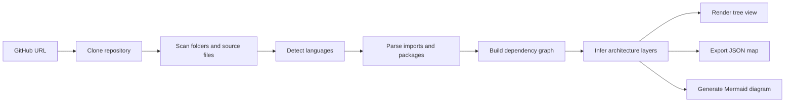
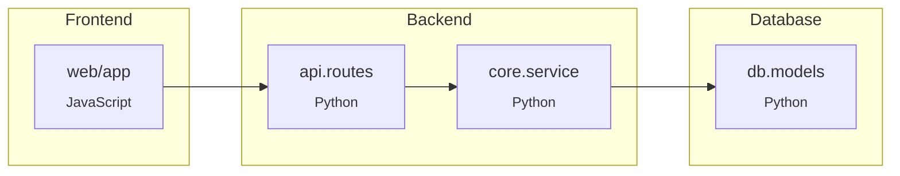
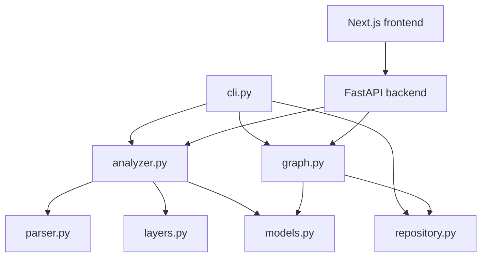

# repomap

Turn any GitHub repository into an architecture diagram.

`repomap` is now both a Python CLI and a web application. It clones a GitHub repository, scans its source tree, detects dependencies across supported languages, and turns the result into a readable architecture map. It is designed for engineers who want a quick structural view of an unfamiliar codebase without manually tracing imports, packages, and folders.

It currently supports Python, JavaScript, and Go projects, and produces these outputs in a single run:

- a folder tree for quick orientation
- a JSON architecture map for tooling and automation
- a Mermaid dependency graph for documentation and sharing
- an interactive web graph rendered with Next.js and D3.js

## Introduction

Modern repositories grow faster than their documentation. `repomap` helps you answer questions like:

- What are the major parts of this repo?
- Which modules depend on each other?
- Is this mostly frontend, backend, database, or infrastructure code?
- How can I visualize the architecture in a format I can paste into GitHub, Notion, or docs?

Instead of generating a vague summary, `repomap` builds a dependency graph from real source files and renders it into outputs that are useful for humans and machines.

## Features

- Accepts a GitHub repository URL and clones it locally
- Detects the primary language automatically
- Supports Python, JavaScript, and Go repositories
- Scans the repository tree while skipping common generated directories
- Builds an internal dependency graph with `networkx`
- Parses Python imports with `ast`
- Resolves JavaScript imports including `import`, `require()`, and dynamic `import()`
- Parses Go packages and imports using `go.mod` when available
- Infers top-level architecture layers such as `Frontend`, `Backend`, `Database`, and `Infrastructure`
- Generates interactive Mermaid diagrams with clickable nodes for GitHub-hosted files
- Exposes a Python web API for remote analysis
- Includes a Next.js frontend for exploring the dependency graph visually
- Exports a JSON architecture map for downstream tooling
- Presents results with a clean CLI powered by `typer` and `rich`

## Demo

Basic usage:

```bash
repomap https://github.com/user/repo
```

Save machine-readable outputs:

```bash
repomap https://github.com/user/repo \
  --json-out architecture.json \
  --mermaid-out architecture.mmd
```

Analyze a specific branch:

```bash
repomap https://github.com/user/repo --branch main
```

Run the web stack locally:

```bash
uvicorn repomap_api.main:app --reload --port 8000
cd web
npm install
npm run dev
```

How `repomap` works:



## Installation

Requirements:

- Python 3.11+
- Git available on your system
- Node.js 20+ for the web frontend

Install locally in editable mode:

```bash
python -m pip install -e .
```

Install with development dependencies:

```bash
python -m pip install -e .[dev]
```

After installation, the CLI is available as:

```bash
repomap --help
```

For the web frontend:

```bash
cd web
cp .env.example .env.local
npm install
npm run dev
```

## Usage

Analyze a public repository:

```bash
repomap https://github.com/user/repo
```

Write artifacts to disk:

```bash
repomap https://github.com/user/repo \
  --json-out out/architecture.json \
  --mermaid-out out/architecture.mmd
```

Keep the cloned repository instead of cleaning up the temporary checkout:

```bash
repomap https://github.com/user/repo --keep-clone
```

Clone into a specific directory:

```bash
repomap https://github.com/user/repo --clone-dir ./tmp
```

CLI options:

```text
repomap [OPTIONS] REPO_URL

Arguments:
  REPO_URL        GitHub repository URL to analyze

Options:
  --branch TEXT   Optional branch to clone
  --clone-dir     Directory where the repository should be cloned
  --json-out      Optional file path for the JSON architecture map
  --mermaid-out   Optional file path for the Mermaid diagram
  --keep-clone    Keep the cloned repository when using a temporary directory
  --help          Show help
```

## Example output

CLI summary:

```text
Project Architecture
D:\temp\repo

Architecture Summary
┏━━━━━━━━━━━━━━━━━━━━━━┳━━━━━━━━━━━━━━━━━━━━━━━━━━━━━━━━━━━━━━━┓
┃ Category             ┃ Details                               ┃
┡━━━━━━━━━━━━━━━━━━━━━━╇━━━━━━━━━━━━━━━━━━━━━━━━━━━━━━━━━━━━━━━┩
│ Primary language     │ Python                                │
│ Detected languages   │ Python (42), JavaScript (8)           │
│ Architecture layers  │ Frontend (6), Backend (18), Database (4) │
└──────────────────────┴───────────────────────────────────────┘
```

Folder tree:

```text
repo
├── api
│   ├── handlers.py
│   └── routes.py
├── core
│   ├── service.py
│   └── utils.py
├── db
│   ├── models.py
│   └── migrations
└── web
    ├── components
    └── app.tsx
```

JSON architecture map:

```json
{
  "repository_url": "https://github.com/user/repo",
  "primary_language": "Python",
  "detected_languages": [
    { "name": "Python", "file_count": 42, "extensions": [".py"] },
    { "name": "JavaScript", "file_count": 8, "extensions": [".ts", ".tsx"] }
  ],
  "architecture_layers": [
    { "name": "Frontend", "module_count": 6 },
    { "name": "Backend", "module_count": 18 },
    { "name": "Database", "module_count": 4 }
  ]
}
```

Generated Mermaid diagram:



The actual Mermaid emitted by `repomap` also includes node classes and `click` actions so diagrams can link back to source files on GitHub.

Interactive web UI:

```text
+-----------------------------------------------------------+
| repomap.vercel.app                                        |
|                                                           |
| [ GitHub repository URL................................. ] |
| [ Branch....... ] [ Analyze repo ]                        |
|                                                           |
|  Interactive architecture graph                           |
|   o Frontend  ---->  o Backend  ---->  o Database         |
|          \                    \                           |
|           \-----> o Shared ----\----> o Infrastructure    |
|                                                           |
|  Sidebar: layers, selected module, folder tree, Mermaid   |
+-----------------------------------------------------------+
```

## Architecture

The project is organized as a small monorepo with a Python backend and a Next.js frontend:

```text
repomap/
├── repomap/
│   ├── analyzer.py
│   ├── cli.py
│   ├── graph.py
│   ├── layers.py
│   ├── models.py
│   ├── parser.py
│   └── repository.py
├── repomap_api/
│   ├── config.py
│   ├── main.py
│   ├── schemas.py
│   └── service.py
└── web/
    ├── app/
    ├── components/
    └── lib/
```

Responsibilities:

- `cli.py` handles the command-line interface and rich terminal output
- `repository.py` handles repository cloning, cleanup, and branch detection
- `parser.py` performs language detection and source-level dependency extraction
- `analyzer.py` coordinates repository scanning and builds the analysis result
- `layers.py` infers higher-level architecture layers from paths and dependencies
- `graph.py` builds the `networkx` graph and renders JSON and Mermaid output
- `models.py` defines the shared data structures used across the project
- `repomap_api/main.py` exposes the FastAPI backend endpoints
- `repomap_api/service.py` wraps repository analysis for the web API
- `web/app` contains the Next.js app router pages and global styles
- `web/components/graph-canvas.jsx` renders the interactive D3 force graph

Internal flow:



## Contributing

Contributions are welcome. Good areas to extend include:

- support for more languages
- more accurate dependency resolution for monorepos
- additional export formats such as Graphviz or HTML
- better heuristics for architecture layer detection
- improved tests and real-world fixtures

Typical local workflow:

```bash
git clone https://github.com/your-name/repomap.git
cd repomap
python -m pip install -e .[dev]
python -m pytest
```

When contributing:

- keep the code modular
- prefer small, focused changes
- add or update tests when behavior changes
- document new CLI flags or output formats in this README

If you find a bug or have an idea for a feature, open an issue or submit a pull request.
