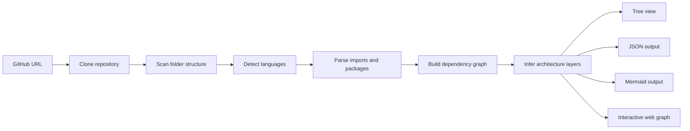
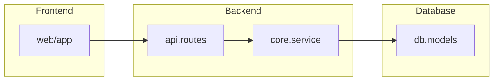
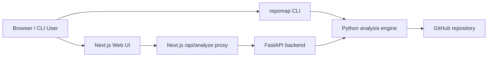

<div align="center">
  <h1>repomap</h1>
  <p><strong>Turn any GitHub repository into an architecture diagram.</strong></p>
  <p>
    Analyze GitHub repositories with a Python engine, FastAPI backend, and Next.js + D3.js web UI.
  </p>
  <p>
    <a href="https://github.com/Huoqichen/repomap/stargazers"></a>
    <a href="https://github.com/Huoqichen/repomap/blob/main/LICENSE"></a>
    
  </p>
  <p>
    <a href="./README.md">English</a> |
    <a href="./docs/README.zh-CN.md">简体中文</a>
  </p>
</div>

---

## Introduction

`repomap` is a repository architecture explorer built around a Python analysis engine, a FastAPI backend, and a Next.js + D3.js frontend. It clones a GitHub repository, scans the source tree, detects dependencies, infers architecture layers, and renders the result as a folder tree, a JSON graph, a Mermaid diagram, and an interactive web graph.

It is designed for developers who want to understand an unfamiliar codebase quickly without manually tracing imports, packages, and directory structure.

## Features

- Analyze GitHub repositories from both CLI and Web UI
- Detect a broad set of source and scripting languages across the repository
- Perform dependency analysis for Python, JavaScript, TypeScript, Go, Rust, Java, Kotlin, C#, PHP, Swift, C/C++, Objective-C, and Ruby
- Perform deeper dependency analysis for Python, JavaScript, TypeScript, Go, Rust, Java, Kotlin, Scala, Groovy, C#, PHP, Swift, C/C++, Objective-C, Ruby, Dart, Lua, Perl, and Shell
- Parse dependencies and build graphs with `networkx`
- Infer top-level architecture layers:
  `Frontend`, `Backend`, `Database`, `Infrastructure`, `Shared`
- Export folder tree, JSON, and Mermaid output
- Render Mermaid as both source and live diagram in the web UI
- Render an interactive graph in the browser with D3.js
- Support graph search and filtering by layer and language in the web UI
- Support graph layout switching in the web UI with force, layered, and radial views
- Resolve JavaScript/TypeScript monorepo workspaces from `package.json`, `pnpm-workspace.yaml`, `lerna.json`, and `tsconfig` / `jsconfig` path aliases
- Cache repository analysis results on disk to speed up repeated requests
- Run large-repository analysis through async job endpoints with progress polling
- Support a production queue backend with Redis + dedicated worker processes
- Proxy frontend requests through Next.js to avoid common local `Failed to fetch` issues
- Support `allowedDevOrigins` for LAN-based Next.js development
- Provide production-ready deployment files for Vercel and Docker

## Language Coverage

`repomap` now separates language support into two levels:

- Repository-wide language detection:
  Python, JavaScript, TypeScript, Go, Rust, Java, Kotlin, Scala, Groovy, C, C++, C#, Swift, Objective-C, PHP, Ruby, Perl, Lua, R, Julia, Dart, Shell, PowerShell, Batch, Tcl, Elixir, Erlang, Haskell, OCaml, F#, Nim, Zig, Crystal, Elm, Clojure, Common Lisp, Scheme, Racket, Fortran, COBOL, Ada, Pascal, Visual Basic, D, Solidity, Move, V, Verilog, VHDL, Assembly, SQL, GraphQL, CSS, HTML, XML, Vue, Svelte, Astro, Nix, Starlark, Terraform, HCL, Bicep, Jsonnet, Cue, Rego, Puppet, Raku, Apex, Haxe, ReasonML, Standard ML, Awk, AppleScript, Dockerfile, Makefile, and CMake.
- Deep dependency analysis:
  Python, JavaScript, TypeScript, Go, Rust, Java, Kotlin, Scala, Groovy, C#, PHP, Swift, C/C++, Objective-C, Ruby, Dart, Lua, Perl, and Shell.
- Generic module inventory for all other detected languages:
  files are still included in the architecture map, tree, graph, and language summary even when deep import resolution is not available.

Detection uses file extensions, special filenames such as `Dockerfile` and `Makefile`, and shebang-based recognition for extensionless scripts.

## Demo

CLI:

```bash
repomap https://github.com/user/repo
repomap https://github.com/user/repo --branch main
repomap https://github.com/user/repo --json-out architecture.json --mermaid-out architecture.mmd
```

Web:

```bash
cp .env.api.example .env
uvicorn repomap_api.main:app --reload --host 0.0.0.0 --port 8000

cd web
cp .env.example .env.local
npm install
npm run dev
```

Open:

```text
http://localhost:3000
```

How it works:



## Installation

Requirements:

- Python 3.11+
- Git
- Node.js 20+

Install Python dependencies:

```bash
python -m pip install -e .
```

Install frontend dependencies:

```bash
cd web
npm install
```

## Run Locally

Start the backend API first from the repository root:

```bash
python -m pip install -e .
python -m uvicorn repomap_api.main:app --host 127.0.0.1 --port 8000
```

In a second terminal, start the frontend:

```bash
cd web
npm install
cp .env.example .env.local
npm run dev
```

Open the app in your browser:

```text
http://127.0.0.1:3000
```

Default local ports:

- Frontend: `http://127.0.0.1:3000`
- Backend API: `http://127.0.0.1:8000`
- Health check: `http://127.0.0.1:8000/health`

## Usage

CLI usage:

```bash
repomap https://github.com/user/repo
```

CLI options:

```text
repomap [OPTIONS] REPO_URL

Arguments:
  REPO_URL

Options:
  --branch TEXT
  --clone-dir PATH
  --json-out PATH
  --mermaid-out PATH
  --keep-clone
  --help
```

Web environment example:

```env
REPOMAP_API_URL=http://127.0.0.1:8000
ALLOWED_DEV_ORIGINS=localhost,127.0.0.1,192.168.164.1
```

Async API example:

```text
POST /api/analyze/jobs
GET  /api/analyze/jobs/{job_id}
```

Production queue environment:

```env
REPOMAP_JOB_BACKEND=redis
REPOMAP_REDIS_URL=redis://localhost:6379/0
REPOMAP_QUEUE_NAME=repomap-analysis
```

## Example Output

Folder tree:

```text
repo
├── api
│   ├── handlers.py
│   └── routes.py
├── core
│   ├── service.py
│   └── utils.py
├── db
│   ├── models.py
│   └── migrations
└── web
    ├── components
    └── app.tsx
```

JSON:

```json
{
  "primary_language": "Python",
  "architecture_layers": [
    { "name": "Frontend", "module_count": 6 },
    { "name": "Backend", "module_count": 18 },
    { "name": "Database", "module_count": 4 }
  ]
}
```

Mermaid:



## Architecture

Project layout:

```text
repomap/
├── repomap/        # Core analysis engine
├── repomap_api/    # FastAPI backend
├── web/            # Next.js + D3.js frontend
├── docs/           # Localized documentation
├── Dockerfile.api
└── docker-compose.yml
```

System flow:



Key modules:

- `repomap/`: repository scanning, parsing, layer inference, graph generation
- `repomap_api/`: HTTP API for analysis
- `web/`: interactive frontend
- `web/app/api/analyze/route.js`: same-origin proxy route for local and production web usage
- `docs/README.zh-CN.md`: Simplified Chinese documentation

## Deployment

Frontend on Vercel:

1. Import the repository into Vercel
2. Set `Root Directory` to `web`
3. Set `REPOMAP_API_URL` to your backend API URL
4. Deploy

Backend with Docker:

```bash
docker build -f Dockerfile.api -t repomap-api .
docker run --rm -p 8000:8000 --env-file .env repomap-api
```

Full stack with Docker Compose:

```bash
docker compose up --build
```

Run a dedicated worker locally:

```bash
repomap-worker
```

## Current Status

Implemented now:

- broad language detection across source and script files
- deep dependency analysis for Python, JavaScript, TypeScript, Go, Rust, Java, Kotlin, Scala, Groovy, C#, PHP, Swift, C/C++, Objective-C, Ruby, Dart, Lua, Perl, and Shell
- stronger JavaScript/TypeScript monorepo resolution for `package.json`, `pnpm-workspace.yaml`, `lerna.json`, and `tsconfig` aliases
- web graph search, filtering, and layout switching
- on-disk analysis caching for repeated repository scans
- async analysis jobs with progress polling for large repositories
- production queue mode with Redis-backed job storage and dedicated workers

Still good next upgrades:

- deeper package-manager-aware monorepo resolution for Turbo, Nx, Cargo workspaces, Maven multi-module, Gradle multi-project, and Bazel
- graph grouping, collapsing, saved views, edge bundling, and layout presets
- incremental re-analysis instead of full rescans

## Contributing

Contributions are welcome. Good next steps include:

- more language-specific parsers
- package-manager-aware monorepo resolution
- queue retries, job prioritization, and operations tooling for large repositories
- graph grouping, layout presets, and collaboration features

---

## Documentation Languages

- [English](./README.md)
- [简体中文](./docs/README.zh-CN.md)

## Star History

<p align="center">
<a href="https://www.star-history.com/?repos=Huoqichen%2Frepomap&type=date&legend=top-left">
 <picture>
   <source media="(prefers-color-scheme: dark)" srcset="https://api.star-history.com/svg?repos=Huoqichen/repomap&type=date&theme=dark&legend=top-left" />
   <source media="(prefers-color-scheme: light)" srcset="https://api.star-history.com/svg?repos=Huoqichen/repomap&type=date&legend=top-left" />
   
 </picture>
</a>
</p>
