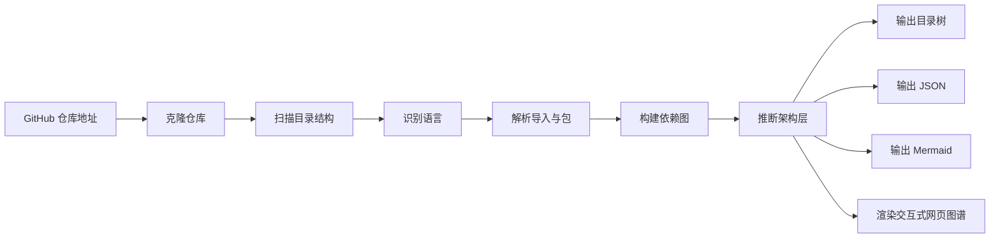
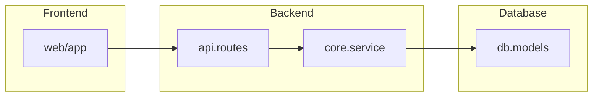
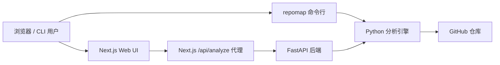

<div align="center">
  <h1>repomap</h1>
  <p><strong>将任意 GitHub 仓库转换为架构图。</strong></p>
  <p>
    使用 Python 分析引擎、FastAPI 后端与 Next.js + D3.js Web 界面分析 GitHub 仓库。
  </p>
  <p>
    <a href="https://github.com/Huoqichen/repograph/stargazers"></a>
    <a href="https://github.com/Huoqichen/repograph/blob/main/LICENSE"></a>
    
  </p>
  <p>
    <a href="../README.md">English</a> |
    <a href="./README.zh-CN.md">简体中文</a>
  </p>
</div>

---

## 简介

`repomap` 是一个仓库架构分析工具，包含 Python 分析引擎、FastAPI 后端以及 Next.js + D3.js 前端。它可以克隆 GitHub 仓库、扫描源码目录、识别依赖关系、推断架构层，并输出目录树、JSON 图、Mermaid 图以及交互式网页图谱。

它适合在你接手陌生项目时，快速理解仓库整体结构，而不必手动追踪导入关系、包结构和目录组织。

## 特性

- 同时支持命令行和 Web 界面分析 GitHub 仓库
- 自动识别 Python、JavaScript、Go
- 使用 `networkx` 构建依赖关系图
- 自动推断顶层架构层：
  `Frontend`、`Backend`、`Database`、`Infrastructure`、`Shared`
- 输出目录树、JSON 和 Mermaid
- 使用 D3.js 在浏览器中渲染交互式架构图
- 通过 Next.js 同源代理减少本地开发时常见的 `Failed to fetch`
- 支持 `allowedDevOrigins`，解决局域网访问 Next.js 开发服务时的警告
- 提供可直接使用的 Vercel 与 Docker 部署配置

## 演示

命令行：

```bash
repomap https://github.com/user/repo
repomap https://github.com/user/repo --branch main
repomap https://github.com/user/repo --json-out architecture.json --mermaid-out architecture.mmd
```

Web：

```bash
cp .env.api.example .env
uvicorn repomap_api.main:app --reload --host 0.0.0.0 --port 8000

cd web
cp .env.example .env.local
npm install
npm run dev
```

打开：

```text
http://localhost:3000
```

工作流程：



## 安装

环境要求：

- Python 3.11+
- Git
- Node.js 20+

安装 Python 依赖：

```bash
python -m pip install -e .
```

安装前端依赖：

```bash
cd ../web
npm install
```

## 用法

命令行：

```bash
repomap https://github.com/user/repo
```

前端环境变量示例：

```env
REPOMAP_API_URL=http://127.0.0.1:8000
ALLOWED_DEV_ORIGINS=localhost,127.0.0.1,192.168.164.1
```

## 输出示例

目录树：

```text
repo
├── api
│   ├── handlers.py
│   └── routes.py
├── core
│   ├── service.py
│   └── utils.py
├── db
│   ├── models.py
│   └── migrations
└── web
    ├── components
    └── app.tsx
```

JSON：

```json
{
  "primary_language": "Python",
  "architecture_layers": [
    { "name": "Frontend", "module_count": 6 },
    { "name": "Backend", "module_count": 18 },
    { "name": "Database", "module_count": 4 }
  ]
}
```

Mermaid：



## 架构

项目结构：

```text
repomap/
├── repomap/        # 核心分析引擎
├── repomap_api/    # FastAPI 后端
├── web/            # Next.js + D3.js 前端
├── docs/           # 多语言文档
├── Dockerfile.api
└── docker-compose.yml
```

系统流程：



核心目录：

- `repomap/`：仓库扫描、依赖解析、架构层推断、图生成
- `repomap_api/`：分析接口服务
- `web/`：交互式前端
- `web/app/api/analyze/route.js`：同源代理路由
- `docs/README.zh-CN.md`：简体中文文档

## 部署

Vercel 前端部署：

1. 在 Vercel 导入仓库
2. 将 `Root Directory` 设为 `web`
3. 设置 `REPOMAP_API_URL` 为后端 API 地址
4. 部署

Docker 部署后端：

```bash
docker build -f Dockerfile.api -t repomap-api .
docker run --rm -p 8000:8000 --env-file .env repomap-api
```

Docker Compose 启动完整栈：

```bash
docker compose up --build
```

## 贡献

欢迎贡献。比较值得继续扩展的方向包括：

- 增加更多语言支持
- 更强的 monorepo 依赖解析
- 面向大仓库的缓存和异步任务
- 图过滤、搜索和布局优化

---

## 文档语言

- [English](../README.md)
- [简体中文](./README.zh-CN.md)

## Star History

<p align="center">
  <a href="https://www.star-history.com/?repos=Huoqichen%2Frepograph&type=date&legend=top-left">
    <picture>
      <source media="(prefers-color-scheme: dark)" srcset="https://api.star-history.com/svg?repos=Huoqichen/repograph&type=Date&theme=dark" />
      <source media="(prefers-color-scheme: light)" srcset="https://api.star-history.com/svg?repos=Huoqichen/repograph&type=Date" />
      
    </picture>
  </a>
</p>
